# Solar System Simulation


A real-time 3D solar system simulation built from scratch using **Vulkan API** and modern C++17, featuring advanced graphics techniques including multi-pass post-processing, physically-based orbital mechanics and custom shader programming.

### Key Technical Achievements

- **Low-level Vulkan API** implementation with complete graphics pipeline management
- **Multi-pass rendering system** post-processing and bloom effect (with HDR)
- **Advanced shader programming** including procedural noise, fBm, normal mapping, TBN matrix construction, PBRT
- **Physically-based orbital simulation** with hierarchical transformations
- **Mesh generation** for celestial bodies
- **Modern C++17** with smart pointers, templates, and RAII principles
- **Cross-platform build system** using CMake and SPIR-V toolchain for shader compliation


## Table of Contents

- [Solar System Simulation](#solar-system-simulation)
    - [Key Technical Achievements](#key-technical-achievements)
  - [Table of Contents](#table-of-contents)
  - [Build Instructions](#build-instructions)
    - [Prerequisites](#prerequisites)
    - [Building](#building)
    - [Running](#running)
  - [Vulkan Pipeline](#vulkan-pipeline)
  - [Rendering](#rendering)
    - [Sun](#sun)
    - [Glow Effect](#glow-effect)
    - [Earth](#earth)
      - [UV Map for Mountain Shadows](#uv-map-for-mountain-shadows)
      - [Reflection from Oceans](#reflection-from-oceans)
      - [Clouds and Cloud Shadows](#clouds-and-cloud-shadows)
    - [Orbits](#orbits)
    - [Skybox](#skybox)
    - [Bloom Effect](#bloom-effect)
  - [Selection Rendering](#selection-rendering)
  - [Orbital Mechanics](#orbital-mechanics)
  - [Camera System](#camera-system)
  - [Memory \& Performance Optimization](#memory--performance-optimization)
  - [Future Works](#future-works)

## Build Instructions

### Prerequisites
- **C++17 Compiler** (MSVC, GCC, or Clang)
- **CMake 3.10+**
- **Vulkan SDK** (latest version)
- **Git** (for submodules)

### Building
```bash
# Clone with submodules
git clone --recursive https://github.com/yourusername/SolarSystem.git
cd SolarSystem

# Compile shaders (windows)
powershell .\compile_shaders.ps1

# Compile shaders (macOS / linux)
./compile_shaders.sh

# Build with CMake
mkdir build
cd build
cmake ..
cmake --build .
```

### Running
```bash
# From build directory
./VulkanEngine

# With verbose logging
./VulkanEngine -vvv
```

## Vulkan Pipeline
The application implements a complete Vulkan rendering pipeline from scratch:

- **Instance & Device Management** - Physical device selection, logical device creation, validation layers
- **Command Buffer System** - Multi-threaded command recording with pool management
- **Descriptor Sets** - Efficient uniform buffer and texture binding
- **Pipeline State Objects** - Custom graphics pipelines for different rendering passes
- **Swap Chain** - Double/triple buffering for smooth frame presentation
- **Memory Management** - Custom allocators for device-local and host-visible memory


## Rendering

### Sun 

I have used a 3D noise function and [fractal Brownian Motion (fBm)](https://en.wikipedia.org/wiki/Fractional_Brownian_motion) to generate a magma like effect for sun's surface. Its variable by time!


fBm Magma effect |
|----------------|
|  |


<p align="center">
  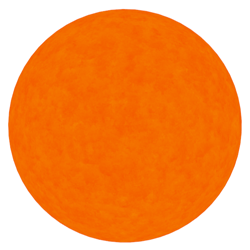
</p>


### Glow Effect

For sun I am also drawing a Glow Sphere. This sphere is rendered specially and Its always prependicular to the view. In this figure you can see the combination of effects for the sun.


<div align="center">

| Sun | Glow Shpere | Sun + Glow Sphere + Bloom |
|-----|-------------|---------------------------|
| 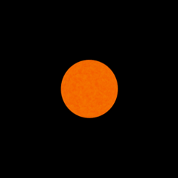 | 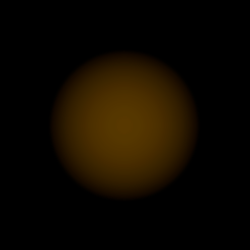 | 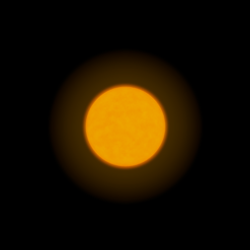 |

</div>


### Earth

We use two textures for day and night versions of Earth.

| Day Texture | Night Texture |
|-------------|---------------|
| 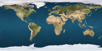 | 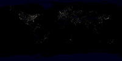 |

Using only these two textures for rendering Earth, we achieve:

<p align="center">
  
</p>


#### Normal mapping for Mountain Shadows

Because our Earth model is made from an ideal sphere, the surface of Earth looks too smooth. In reality, mountains cast complicated shadows on the surface, and the shadow representation of bumpy geography adds realism to the texture.

<div align="center">

| Without UV Maps | With UV Maps |
|-----------------|--------------|
| 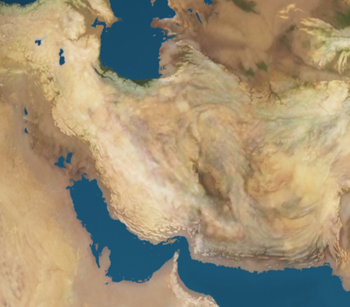 | 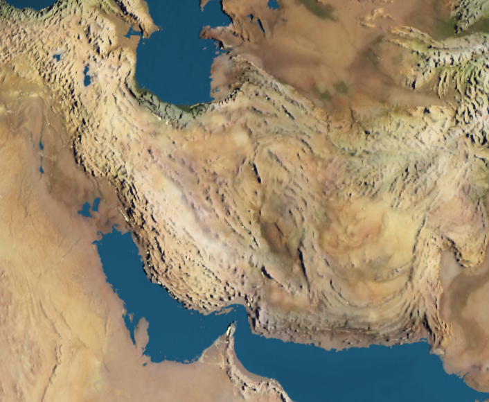 |

</div>

#### Reflection from Oceans

Using a specular texture map, we can add specular reflection effects.

| Specular Map |
|--------------|
| 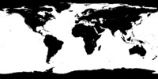 |

With the specular map applied, we achieve:

<p align="center">
  
</p>


#### Clouds and Cloud Shadows

Adding a cloud texture layer and generating shadows based on the direction of light, we achieve:

<p align="center">
  
</p>


### Orbits

Orbits are planes rendered with an special fragment shader.


<p align="center">
  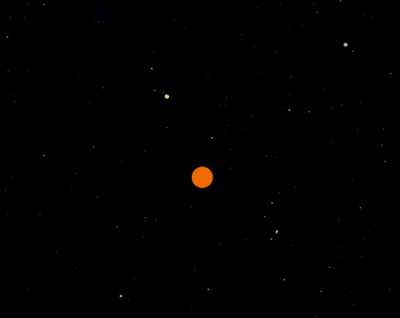
</p>


### Skybox

Skybox is created by creating a Cubemap texture. an special shader is then used to draw the skybox using the cubemap texture.


<p align="center">
  
</p>

### Bloom Effect

The bloom implementation uses:
- **Glow extraction pass** - Isolates bright regions above threshold
- **Two-pass separable Gaussian blur** - Horizontal and vertical 5-tap kernels
- **HDR composition** - Tone mapping with exposure control
- **Ping-pong framebuffers** - Efficient iterative blur passes


<div align="center">

| Bloom Off | Bloom On |
|-----------|----------|
|  | 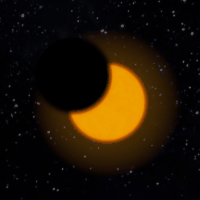 |

</div>


## Object selection via off-screen framebuffer
The program renders the scene to an off-screen framebuffer where each object is drawn using a unique solid color that represents its ID. When the user clicks, sample the corresponding pixel from this ID texture and decode the color to determine which object was selected.


<div align="center">

| Scene | Off-screen Framebuffer |
|-------|------------------------|
| 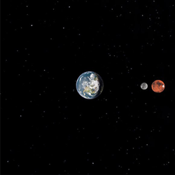 |  |

</div>

## Orbital Mechanics
Each celestial body follows Kepler's laws:
- **Elliptical Orbits** - Configurable semi-major axis and eccentricity
- **Angular Velocity** - Time-based position updates
- **Hierarchical Transforms** - Parent-child relationships (Earth-Moon system)
- **Rotation & Revolution** - Separate spin and orbit parameters

## Camera System
Smooth camera movement with:
- **Orbit Controls** - Spherical coordinate system (azimuth, elevation, distance)
- **Target Following** - Automatic transitions when selecting objects
- **Cubic Ease-in-out** - Smooth animation curves
- **Mouse/Scroll Input** - Intuitive user interaction

## Memory & Performance Optimization

- **Vertex/Index Buffers** - Optimized mesh data with minimal duplication
- **Uniform Buffer Objects** - Per-frame and per-object data uploads
- **Descriptor Set Pooling** - Reusable descriptor allocations
- **Pipeline Caching** - Reduced shader compilation overhead
- **Smart Pointers** - Automatic resource cleanup, zero memory leaks
- **RAII Principles** - Exception-safe Vulkan object management

---

## Future Works

- [ ] Additional moons of planets (Moons of Jupiter, Saturn, etc.)
- [ ] Particle system for asteroid belt
- [ ] Atmospheric scattering and Fresnel effect.
- [ ] Handle Eclipse! 🌚

---


**Built with passion for computer graphics and real-time rendering ⚡**