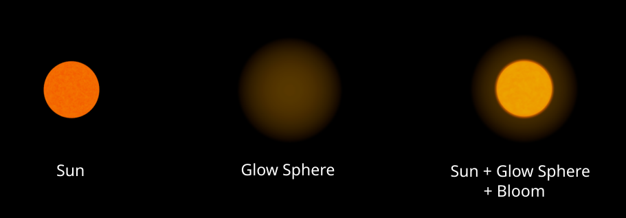

# Solar System

A 3D solar system simulation built with Vulkan.

## Sun 

I have used a 3D noise function and [fractal Brownian Motion (fBm)](https://en.wikipedia.org/wiki/Fractional_Brownian_motion) to generate a magma like effect for sun's surface. Its variable by time!

fBm Magma effect | Sun |
|----------------|-----|
 |  |

### Glow Effect

For sun I am also drawing a Glow Sphere. This sphere is rendered specially and its allways facing the camera. In this figure you can see the combination of effects for the sun.

  

## Earth

We use two textures for day and night versions of Earth.

| Day Texture | Night Texture |
|-------------|---------------|
|  |  |

Using only these two textures for rendering Earth, we achieve:

  

### UV Map for Mountain Shadows

Because our Earth model is made from an ideal sphere, the surface of Earth looks too smooth. In reality, mountains cast complicated shadows on the surface, and the shadow representation of bumpy geography adds realism to the texture.

| Without UV Maps | With UV Maps |
|-----------------|--------------|
|  |  |

### Reflection from Oceans

Using a specular texture map, we can add specular reflection effects.

| Day Texture | Night Texture | Specular Map |
|-------------|---------------|--------------|
|  |  |  |

With the specular map applied, we achieve:

  

### Clouds and Cloud Shadows

Adding a cloud texture layer and generating shadows based on the direction of light, we achieve:

  

# Orbits

Orbits are planes rendered with an special fragment shader.

# Skybox

Skybox is created by creating a Cubemap texture. an special shader is then used to draw the skybox using the cubemap texture.

  

# Bloom Effect

Bloom effect has been implemented using a multi pass rendering system. 
